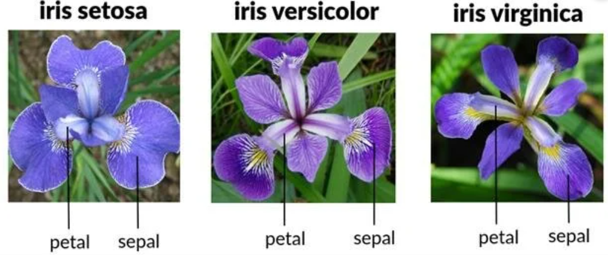
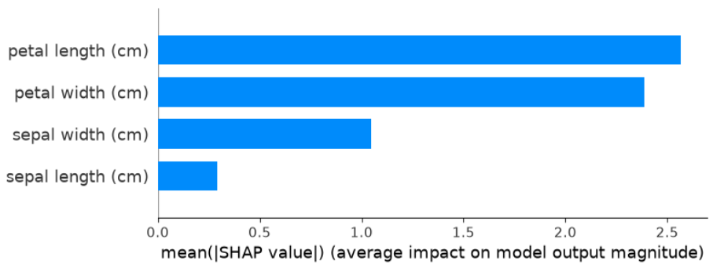

<h2>

🌸 Iris Classification using Machine Learning 🌸

</h2>

Predicting Iris Species with **XGBoost, Cross-Validation, ROC-AUC & SHAP**

A machine learning project exploring classification, model evaluation and interpretability using the classic Iris dataset.

<h3>

About the Project

</h3>

The Iris dataset is one of the most well-known datasets in machine learning. It contains measurements of iris flowers and their corresponding species.

**AIM:**
To build a machine learning pipeline capable of predicting the species of an iris flower from its physical measurements, while also investigating how reliable and interpretable the model is.

The project covers:
* 🤖 Machine learning classification using XGBoost
* 🔄 Stratified K-Fold cross-validation
* 📈 ROC-AUC analysis
* 🔍 Model interpretation using SHAP
* 📊 Visualisation of model performance
* 🧠 Understanding which features drive predictions

<h3>

The Iris Dataset

</h3>

The dataset contains 150 observations across three iris species:
* 🌷 Iris setosa- 50 observations
* 🌹 Iris versicolor- 50 observations
* 🌻 Iris virginica- 50 observations

Each flower is described using four measurements:
* 📏 Sepal length
* 📐 Sepal width
* 🌿 Petal length
* 🌿 Petal width

**01 — 🤖 Machine Learning Model**

The first stage of the project involved developing an XGBoost classification model to predict the species of an iris flower based on its four measurements.

* 🌱 Sepal Length
* 🌱 Sepal Width
* 🌱 Petal Length
* 🌱 Petal Width

The model learns patterns between the physical characteristics of the flowers and their known species.

_Why XGBoost?_

XGBoost (Extreme Gradient Boosting) was selected because it is a powerful and widely used machine learning algorithm for classification and regression problems.
It builds an ensemble of decision trees sequentially, with each new tree attempting to improve on the errors made by previous trees.

**02 — 🔄 Stratified K-Fold Cross-Validation**

To assess whether the model’s performance was consistent across different subsets of the data, Stratified K-Fold Cross-Validation was performed.

_What does it do?_

The dataset is divided into multiple folds.
For each iteration:

* 🧪 One fold is used for validation
* 🏋️ The remaining folds are used for training
* 📊 Model performance is calculated
* 🔁 The process is repeated across all folds

Stratification ensures that the proportion of each iris species is maintained within each fold.

**03 — 📈 ROC-AUC Classification**

The next step was to evaluate the model using _Receiver Operating Characteristic (ROC)_ curves and _Area Under the Curve (AUC)_.

ROC-AUC provides an additional measure of how well the classifier can distinguish between different classes.

An AUC closer to 1.0 indicates stronger discriminatory performance, whereas an AUC closer to 0.5 indicates performance closer to random classification.

**04 — 🔍 SHAP Model Interpretability**

Accuracy tells us how well a model performs but there’s another important question:

*Why did the model make its predictions?*

This is where SHAP (SHapley Additive exPlanations) comes in.
SHAP was used to investigate how individual features contributed to the model’s predictions.

*What did SHAP tell us?*

The SHAP analysis provides insight into how the four flower measurements influence the model’s predictions and contribute differently to the classification of each species.
This makes the model more interpretable than simply reporting its accuracy.

🌷 Thanks for checking out the project! 🌷
